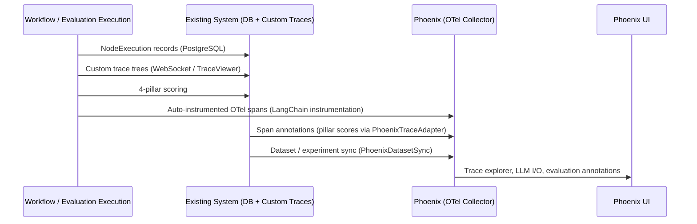

# Phoenix Integration — Architecture Decision Record

## Why Phoenix

Phoenix was chosen as the primary observability layer for Agentic Studio:

- **Open-source and self-hosted** — no vendor lock-in, data stays on-premise
- **OTel-native** — built on OpenTelemetry, the industry-standard observability framework
- **LLM-aware** — purpose-built for LLM trace exploration with prompt/response inspection, token tracking, and evaluation annotations
- **Vendor-neutral** — uses OpenInference semantic conventions, interoperable with other OTel-compatible backends

Phoenix replaces LangSmith as the active integrated tracing layer. LangSmith configuration remains in `.env.example` for teams that prefer it, but Phoenix is the primary integration with deep evaluation pipeline support.

## Dual-Feed Architecture

Agentic Studio maintains two parallel observability feeds: the existing custom trace system (PostgreSQL + WebSocket) and Phoenix (OTel). Neither replaces the other — they serve complementary purposes.

## Key Integration Points

| File | Role |
|------|------|
| `backend/services/phoenix/config.py` | `PhoenixConfig` dataclass, `get_phoenix_config()`, `resolve_phoenix_config()` (per-run override merge), `resolve_project_id()`, `build_trace_path()` / `build_project_path()` URL helpers |
| `backend/services/phoenix/instrumentation.py` | `initialize_phoenix_instrumentation()`, idempotent, non-fatal, called from `app.py` lifespan; `GatedSpanProcessor` + `ProjectRoutingSpanProcessor` |
| `backend/services/phoenix/tracing.py` | `phoenix_workflow_context()` — sets per-workflow project routing, session, metadata, and tags; `phoenix_root_span()` — captures OTel trace/span IDs for deep-linking; `PhoenixContext` dataclass |
| `backend/services/phoenix/annotations.py` | `annotate_execution_span()` — post-execution span annotations with status, duration, node count; returns `trace_reference` dict |
| `backend/services/phoenix/project_routing.py` | `using_project()` context manager (ContextVar-based, concurrency-safe), `ProjectRoutingSpanProcessor`, `get_current_project()` |
| `backend/services/evaluation/phoenix_adapter.py` | `PhoenixTraceAdapter.export_run_traces()`, correlates spans via `agentic_studio.execution_id` metadata, annotates with pillar scores, returns `trace_reference` dicts |
| `backend/services/phoenix/evaluators.py` | `PhoenixEvaluatorBridge.run_supplementary_evals()`, faithfulness + tool-selection + LLM judge evaluators, non-fatal supplement to 4-pillar scoring |
| `backend/services/phoenix/dataset_sync.py` | `PhoenixDatasetSync.sync_run_to_experiment()`, mirrors evaluation datasets and run results into Phoenix experiments |

## Base URL vs OTLP Endpoint

Two distinct URLs are used for different purposes:

- **`PHOENIX_ENDPOINT`** — the OTLP collector URL (e.g. `http://phoenix:6006/v1/traces`). Used by `phoenix.otel.register()` to send auto-instrumented spans. This is the machine-to-machine endpoint.
- **`PHOENIX_UI_URL`** — the human/client-facing base URL (e.g. `http://localhost:6006`). Used by `PhoenixConfig.client_base_url` for deep-links in the frontend.

`PhoenixConfig` exposes two derived properties:

- **`api_base_url`** — for server-to-server calls (backend → Phoenix REST API). Prefers `endpoint` (strips `/v1/traces` suffix).
- **`client_base_url`** — for browser-facing deep-links. Prefers `ui_url`, falls back to stripping `endpoint`.

## Runtime Configuration Toggle

Phoenix settings are read from the `system_settings` database table first, falling back to environment variables.
This allows toggling Phoenix on/off via the Settings UI without restarting the backend.
The `GatedSpanProcessor` checks `get_phoenix_config().enabled` on every span export,
suppressing spans at runtime when Phoenix is disabled.

## Per-Workflow Project Routing

Workflow executions are routed to separate Phoenix projects (named after the workflow).
The `ProjectRoutingSpanProcessor` uses a `ContextVar` to stamp `openinference.project.name` on each span,
making it safe for concurrent asyncio tasks.
The `phoenix_workflow_context()` context manager in `tracing.py` sets up the project routing,
session, metadata tags, and user context for each execution.

## Evaluation Configuration

`PhoenixConfig` includes evaluation-specific fields that control supplementary evaluators:

| Field | Env Var | Default | Purpose |
|-------|---------|---------|---------|
| `eval_penalty_enabled` | `PHOENIX_EVAL_PENALTY_ENABLED` | `false` | Apply quality penalty for low-faithfulness results |
| `eval_model_deployment_id` | `PHOENIX_EVAL_MODEL_DEPLOYMENT_ID` | _(empty)_ | LLM deployment used by Phoenix evaluators |
| `eval_faithfulness_enabled` | `PHOENIX_EVAL_FAITHFULNESS_ENABLED` | `true` | Run hallucination/faithfulness evaluator |
| `eval_tool_selection_enabled` | `PHOENIX_EVAL_TOOL_SELECTION_ENABLED` | `true` | Run tool-selection evaluator |
| `eval_llm_judge_enabled` | `PHOENIX_EVAL_LLM_JUDGE_ENABLED` | `false` | Run Phoenix LLM quality judge (supplementary to built-in judge) |

## Current Limitations / Best-Effort Semantics

- **Non-fatal** — all Phoenix operations are wrapped in try/except; failures are logged as warnings and never block evaluation runs or workflow execution
- **Trace deep-links** require successful span correlation (matching `agentic_studio.execution_id` in span metadata, set by `phoenix_workflow_context`) and a persisted `trace_reference` on the evaluation result
- **Supplementary evaluators** (`PhoenixEvaluatorBridge`) skip silently when `phoenix.evals` is not installed, context/output is absent, or the evaluator class is not found in the installed SDK version
- **Dataset/experiment sync** is idempotent but may partially succeed (e.g. dataset created but experiment creation failed)

## Python Packages

| Package | Purpose |
|---------|---------|
| `arize-phoenix-otel` | OTel registration and span export to Phoenix |
| `arize-phoenix-client` | REST client for span queries, annotations, dataset/experiment management |
| `openinference-instrumentation-langchain` | Auto-instrumentation for LangChain/LangGraph calls |
| `openinference-semantic-conventions` | Semantic attribute keys for OpenInference spans |
| `arize-phoenix-evals` | Supplementary LLM evaluators (faithfulness, tool-selection) |
