# Evaluations

Evaluations let you systematically test your workflows against a set of inputs, score the results across multiple quality pillars,
and get AI-generated recommendations for improvement. Instead of manually running a workflow and eyeballing the output,
you define a **dataset** of test cases, kick off a **run**, and get structured scores for quality, reliability, latency, and cost.

This guide covers the full evaluation workflow, then walks through a concrete example using the **Account Unlock Investigation** workflow.

---

## Core Concepts

| Concept | What it is |
|---------|-----------|
| **Dataset** | A collection of test cases for evaluating a workflow, agent, tool, or model |
| **Test Case** | A single input (with optional expected output, judge criteria, and file attachments) |
| **Run** | An execution of every test case in a dataset against a target, producing scored results |
| **Result** | The per-test-case score breakdown (quality, cost, reliability, latency) |
| **Recommendation** | An AI-generated suggestion for improving your workflow based on run results |
| **Baseline** | A reference run that future runs are compared against for regression detection |

---

## Opening Evaluations

Click **Evaluations** in the left navigation. The page has three tabs:

- **Datasets** — create, browse, and manage test case collections
- **Runs** — trigger evaluation runs and review results
- **Settings** — configure default models, pillar weights, judge output policies, and auto-evaluation triggers

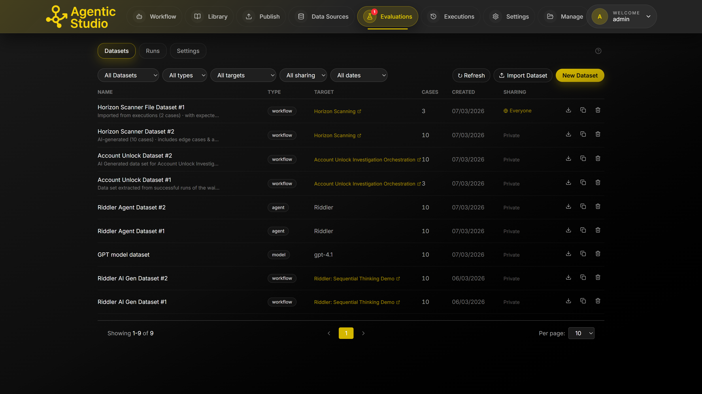

---

## Step 1: Create a Dataset

From the **Datasets** tab, click **New Dataset**.

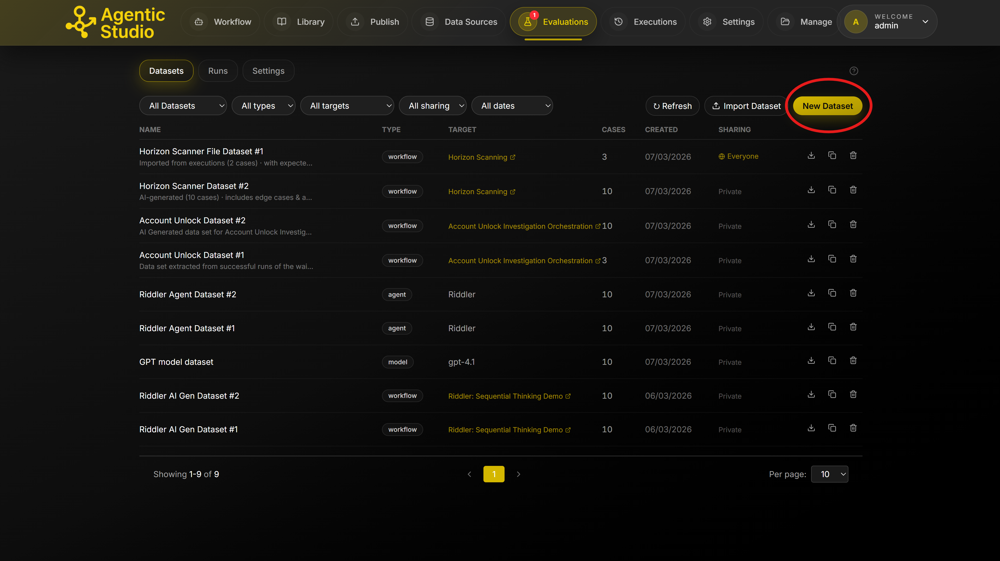

Fill in the creation form:

| Field | Description |
|-------|-------------|
| **Dataset Name** | A descriptive name (e.g. "Account Unlock — Investigation Regression Suite") |
| **Description** | Optional notes about the dataset's purpose or source |
| **Target Type** | What you're evaluating: Workflow, Agent, Model, or Tool |
| **Workflow** | The workflow to evaluate (when target type is Workflow) |

Click **Create Dataset** to proceed to the dataset editor.

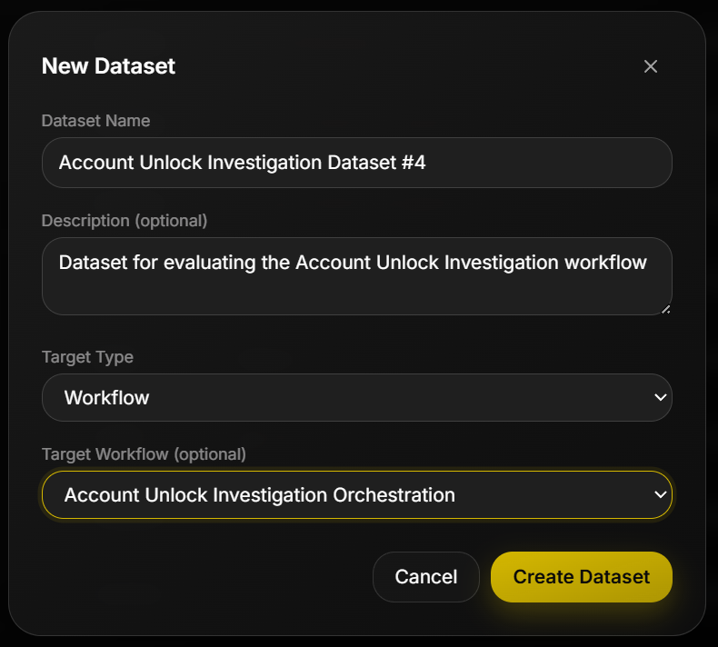

---

## Step 2: Add Test Cases

The dataset editor opens with several tabs. The **Cases** tab shows existing test cases (empty for a new dataset). Use the other tabs to populate test cases:

### Manual Entry

Select the **Add Manual** tab. Enter the input that will be sent to the workflow, an optional expected output for the judge to compare against, and optional judge criteria and tags.

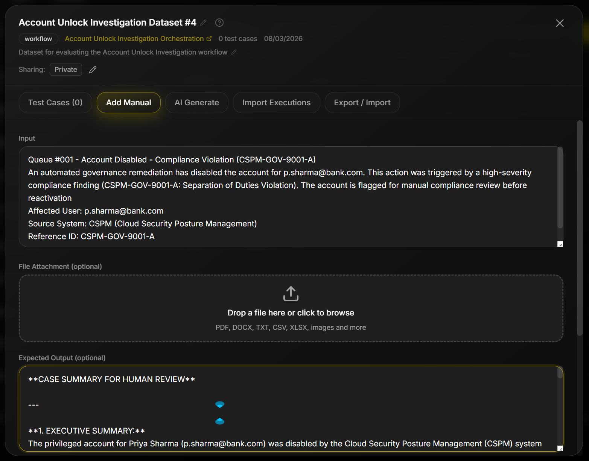

| Field | Required | Description |
|-------|----------|-------------|
| **Input** | Yes | The message or data sent to the workflow (JSON) |
| **Expected Output** | No | A reference answer the AI judge compares the actual output against |
| **Judge Criteria** | No | Custom criteria the judge should evaluate (e.g. "completeness", "factual accuracy") |
| **Tags** | No | Comma-separated labels for filtering (e.g. `happy-path`, `edge-case`) |
| **File Attachment** | No | Upload a file (PDF, DOCX, images, etc.) to include with the input |

Click **Add Test Case** to save it to the dataset.

### AI Generation

Select the **AI Generate** tab to have an LLM create test cases automatically from a seed prompt. This is useful for quickly building large, varied test suites.

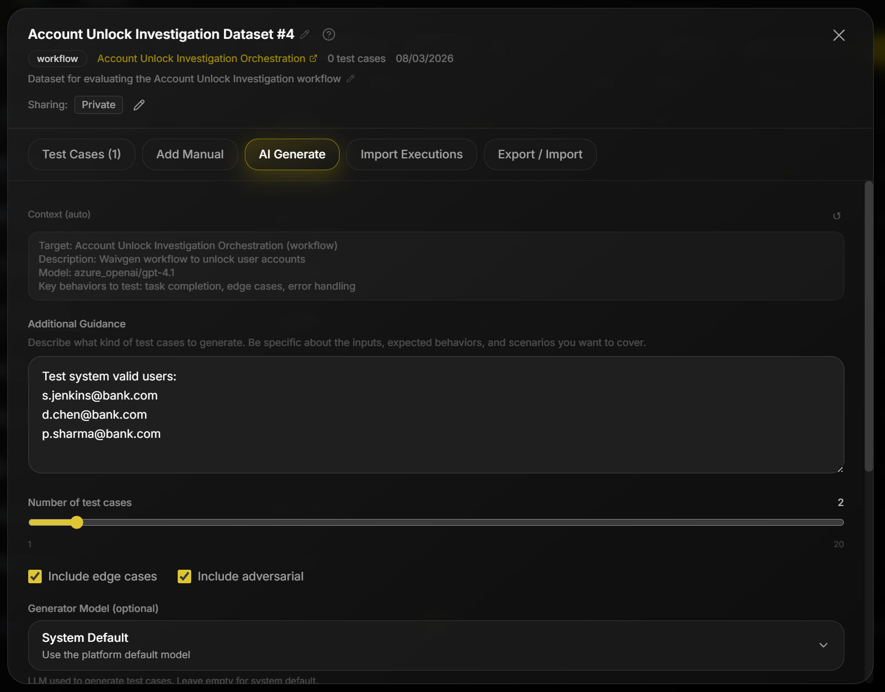

| Field | Description |
|-------|-------------|
| **Seed Prompt** | Describe the kinds of test cases you want generated |
| **Count** | How many test cases to generate (1–200) |
| **Include edge cases** | Generate unusual or boundary-condition inputs |
| **Include adversarial inputs** | Generate inputs designed to challenge the workflow |
| **Generator Model** | Which LLM to use for generation |
| **Examples from Runs** | Select previous workflow runs (that received positive feedback) as few-shot examples for the AI generator |

Click **Generate** to start. Progress streams in real time — test cases are saved as they arrive, so partial results survive if you stop early.

### Import from Executions

Select the **Import Executions** tab to convert previous workflow runs (that received positive feedback) into test cases. This is a fast way to build a regression suite from known-good outputs.

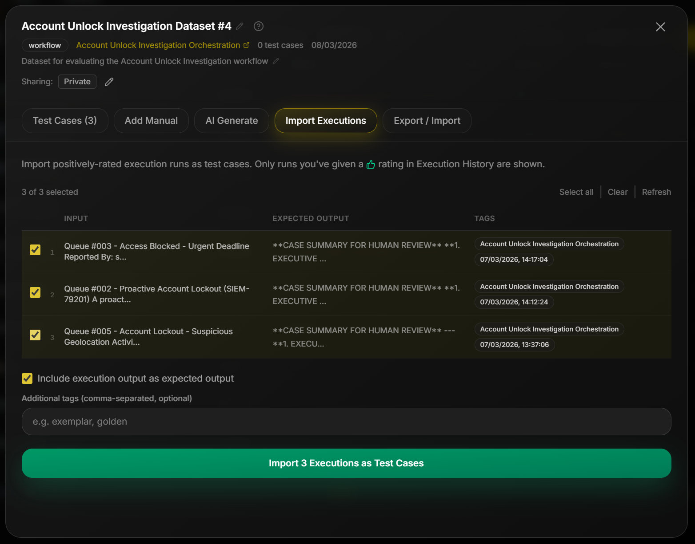

### File Attachments

For workflows that accept file uploads (like Account Unlock Investigation, which may process supporting documents
such as ID verification scans or access request forms), you can attach a file to any test case.
Drag and drop or click **Drop a file here or click to browse** in the file attachment area.
Supported formats include PDF, DOCX, TXT, CSV, XLSX, images, and more.

---

## Step 3: Start an Evaluation Run

Switch to the **Runs** tab and click **+ New Run**.

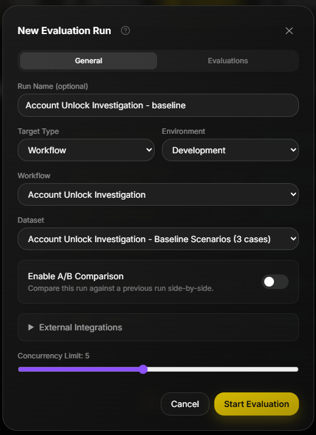

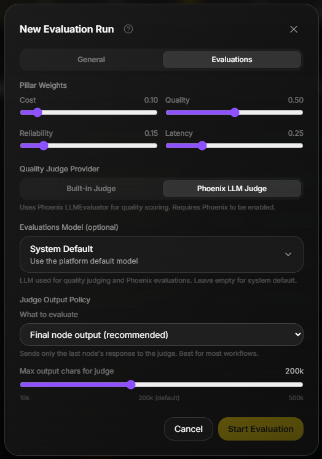

Configure the run:

| Field | Description |
|-------|-------------|
| **Run Name** | Optional label (e.g. "CRD VI Baseline Run") |
| **Dataset** | Which dataset to evaluate |
| **Target Type** | Workflow, Agent, Model, or Tool |
| **Workflow** | The workflow to run test cases against |
| **Environment** | Development, UAT, or Production (affects regression policy) |
| **Judge Model** | The LLM that scores each response |
| **Pillar Weights** | How Quality, Reliability, Latency, and Cost contribute to the composite score (must sum to 1.0) |
| **Concurrency Limit** | How many test cases execute in parallel |
| **Quality Judge Provider** | **Built-in** (default) or **Phoenix** — which judge scores quality |
| **Judge Output Policy** | What the judge evaluates: **Final node output** (recommended), **Specific node output**, or **All node outputs** |
| **Max Output Chars** | Truncation limit for output sent to the judge LLM (prevents context length errors) |

Click **Start Run**. The run appears in the list with a **Running** status badge and updates automatically as test cases complete.

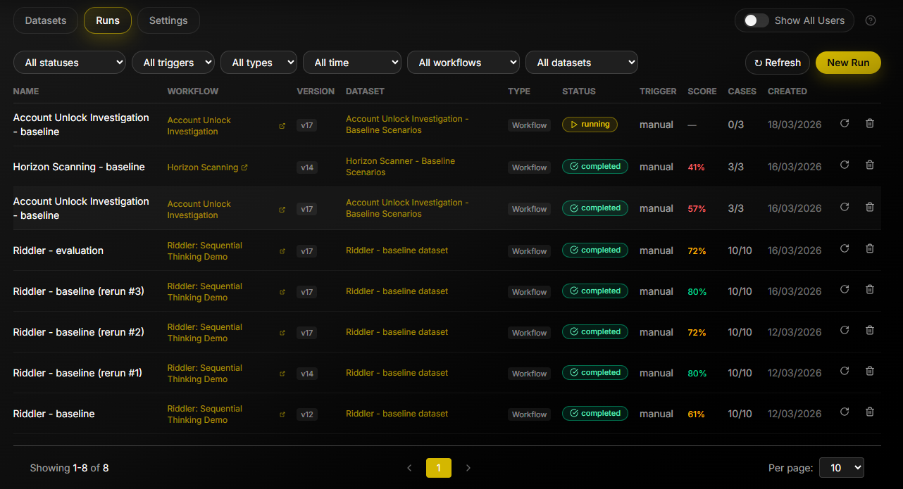

---

## Step 4: Review Results

Click a completed run to open the detail view.

### Score Cards

The header shows the overall **Composite** score and the four pillar scores:

| Pillar | What it measures |
|--------|-----------------|
| **Quality** | How well the output matches expectations (scored 0–100 by the AI judge) |
| **Reliability** | Whether the workflow executed successfully without errors |
| **Latency** | How fast the workflow responded (faster = higher score) |
| **Cost** | How efficiently tokens were used (lower cost = higher score) |

Scores are colour-coded: green (80%+), amber (60–79%), red (below 60%).

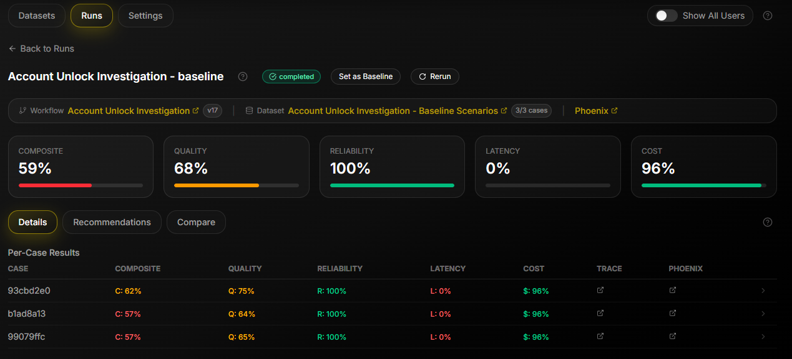

### Per-Case Results

The **Details** sub-tab shows a table of every test case with its individual scores. Click any row to expand a detail panel showing the full input, actual output, judge reasoning, and raw metrics.

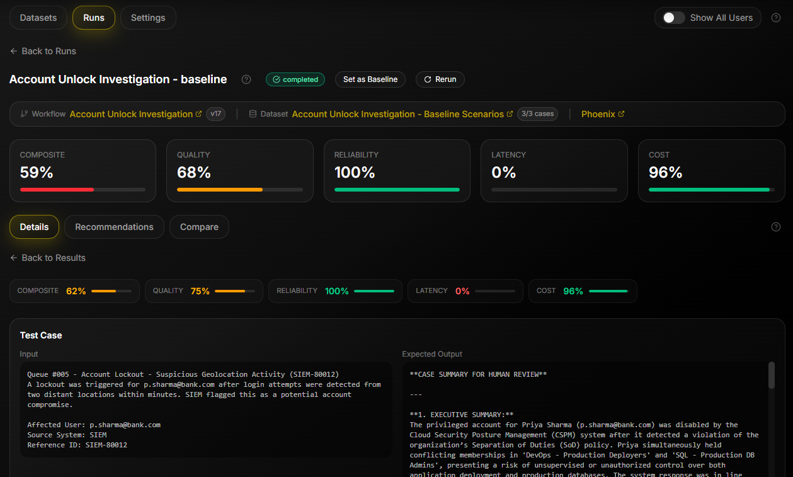

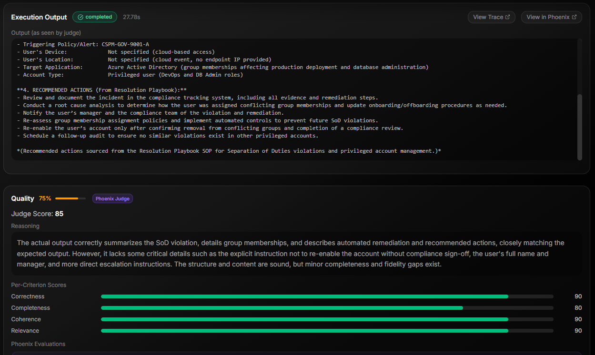

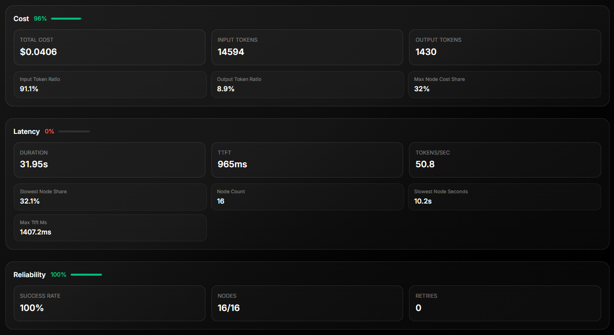

The **Trace** link on each row opens the execution in the workflow viewer, so you can see exactly how each node processed the input.

---

## Step 5: Compare Runs

Use the **Compare** sub-tab to see a side-by-side comparison with another run. Select a run from the dropdown and click **Compare**.

The comparison shows per-pillar deltas (e.g. "+8% Quality") and declares a winner based on the composite score. This is most useful for verifying that a workflow change actually improved performance.

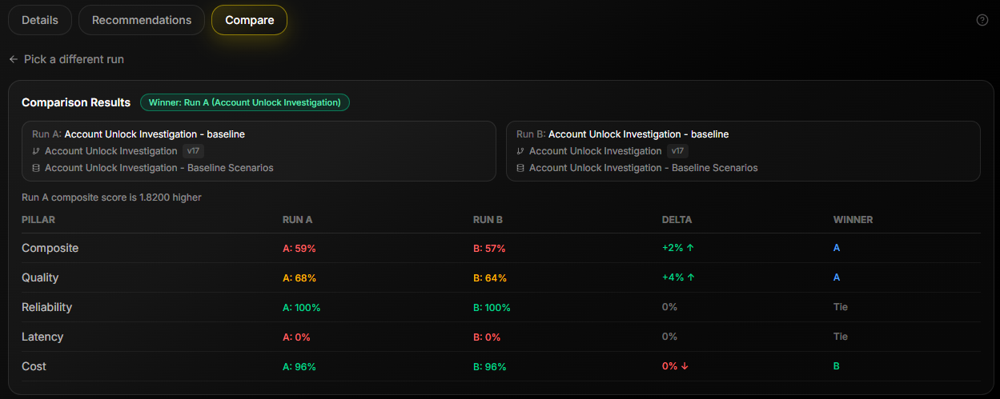

> **Tip:** For meaningful comparisons, compare runs that use the same dataset.

---

## Step 6: Review and Apply Recommendations

After a run completes, the system generates AI-powered recommendations. Open the **Recommendations** sub-tab to see them.

Each recommendation includes:

| Field | Description |
|-------|-------------|
| **Title** | What the recommendation suggests |
| **Type** | `prompt_edit`, `model_swap`, `param_change`, `tool_replace`, or `guardrail_adjust` |
| **Risk Tier** | `low`, `medium`, `high`, or `critical` — determines the approval workflow |
| **Rationale** | Why this change is suggested, based on patterns in the results |
| **Expected Impact** | Projected improvements (e.g. "–12% cost", "+5% quality") |

For **prompt edits**, click **Review & Apply** to see a visual diff of the current vs proposed system prompt. You can edit the proposed text before applying.

For **low-risk** changes (model swap, parameter change), click **Apply** to apply immediately.

For **medium/high-risk** changes, a confirmation dialog explains the impact before you proceed.

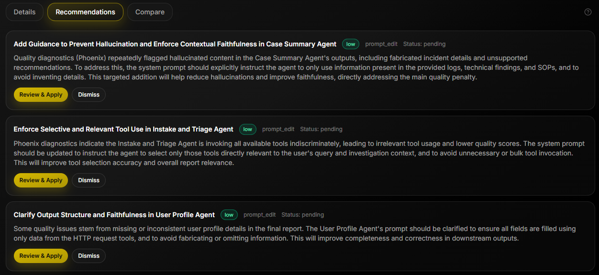

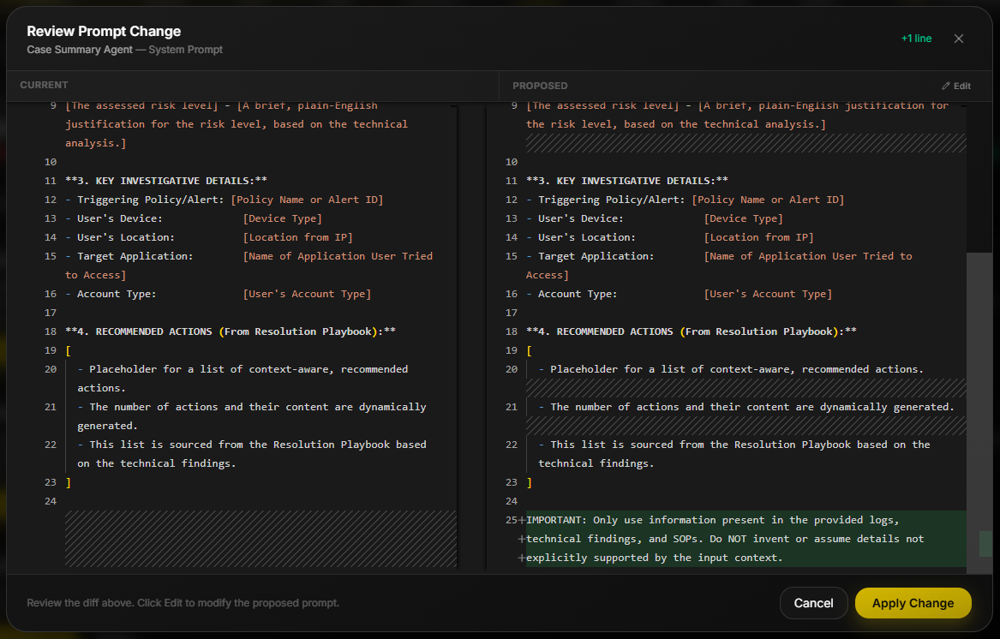

---

## Step 7: Set a Baseline

Once you have a run that represents your quality bar, click **Set as Baseline** in the run detail header. Future runs against the same dataset will be compared to this baseline automatically.

If a future run's scores drop significantly, the system flags a **regression**:

| Severity | Trigger | Effect |
|----------|---------|--------|
| **Moderate** | 10% composite score drop | Warning displayed on the run |
| **Severe** | 20% composite score drop | Warning displayed; in production, blocks automated deployment until acknowledged |

<!-- SCREENSHOT: Run with a regression warning badge -->

---

## Auto-Evaluation

You can configure workflows to be evaluated automatically whenever they are published or modified.
Go to **Settings → Auto-Evaluation**, select a workflow from the dropdown, and enable the triggers.
The configuration form has two inner tabs: **General** (triggers, dataset, environment, debounce)
and **Evaluations** (pillar weights, judge provider, judge model, output policy).

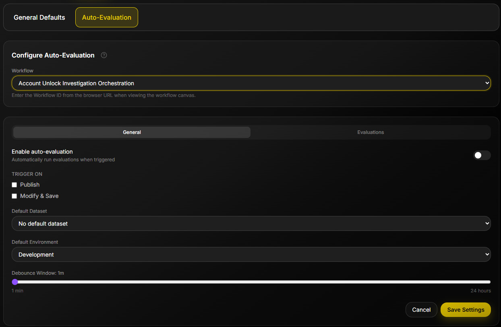

| Setting | Description |
|---------|-------------|
| **Trigger on publish** | Run evaluation when the workflow is published |
| **Trigger on modify** | Run evaluation when the workflow definition is saved |
| **Dataset** | Which dataset to use |
| **Environment** | Default environment (Development, UAT, or Production) |
| **Debounce Window** | Minimum time between auto-triggered runs (slider from 1 minute to 24 hours) |
| **Pillar Weights** | Scoring configuration (must sum to 1.0) |
| **Quality Judge Provider** | Built-in or Phoenix LLM Judge |
| **Judge Model** | Which LLM scores quality (leave empty for system default) |
| **Judge Output Policy** | What to evaluate: final node, specific node, or all nodes |
| **Max Output Chars** | Truncation limit for output sent to the judge |

Auto-evaluation results appear in the **Runs** tab like any manual run.

---

## Sharing Datasets

By default, datasets are private. To share a dataset with your team:

1. Open the dataset in the editor
2. Click the **edit** (pencil) button to open the dataset metadata form
3. In the **Sharing** section, toggle from **Private** to **Shared**
4. Optionally select specific groups using the group selector (defaults to everyone)
5. Click **Save**

Shared datasets appear as **read-only** for other users — they can use them in evaluation runs but cannot modify the test cases. Other users can **clone** a shared dataset to create their own editable copy.

You can also **Export** a dataset as JSON and **Import** it on another instance. There are two ways to import:

- Use the **Import Dataset** button on the Datasets tab to import a full dataset from a JSON file
- Use the **Export / Import** tab inside the dataset editor to export the current dataset or import test cases

---

## Walkthrough: Evaluating the Account Unlock Investigation Workflow

This section walks through a complete evaluation session for the **Account Unlock Investigation** workflow — a three-agent pipeline that triages account unlock requests, investigates security signals, and produces a risk-scored recommendation.

The workflow has three agents:

| Agent | Role |
|-------|------|
| **Triage** | Ingests the unlock request, gathers account metadata (lock reason, failed login history, IP addresses), and produces an initial risk assessment |
| **Investigation** | Analyses security signals (geo-location anomalies, device fingerprints, recent activity patterns) and cross-references against known fraud indicators |
| **Decision & Report** | Synthesises findings into a risk score, an unlock/deny recommendation, and a structured investigation report with supporting evidence |

---

## 1. Create the Dataset

Navigate to **Evaluations → Datasets** and click **New Dataset**.

- **Dataset Name:** `Account Unlock — Investigation Scenarios`
- **Description:** `Test suite for account unlock request processing. Covers legitimate unlock requests, suspicious activity patterns, and edge cases like VIP accounts and recently onboarded users.`
- **Target Type:** Workflow
- **Workflow:** Account Unlock Investigation

Click **Create Dataset**.

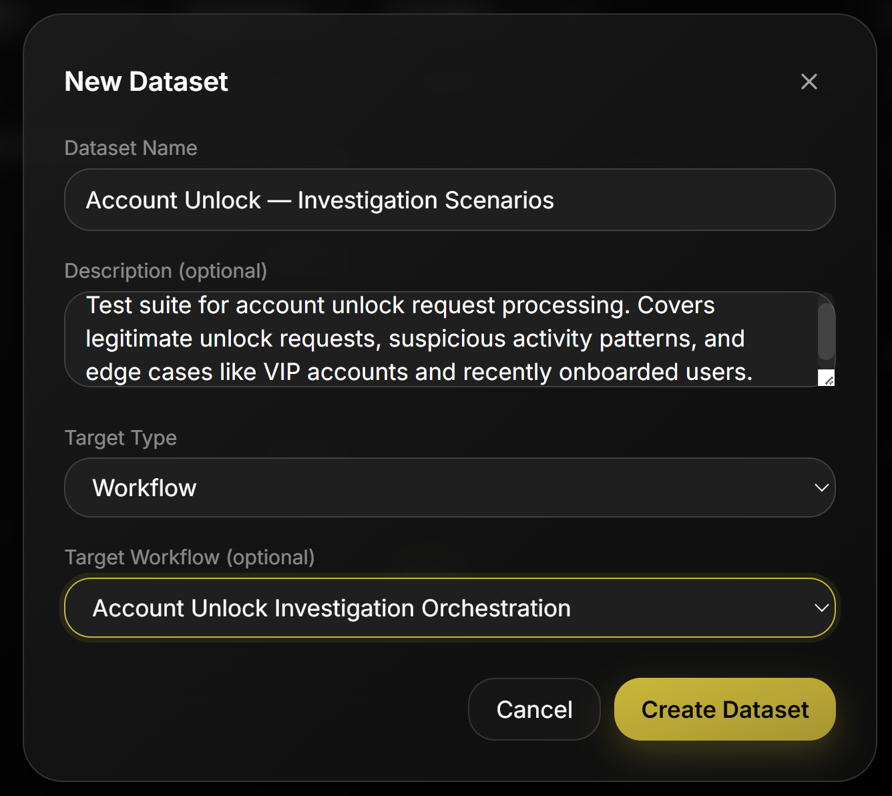

---

## 2. Add Test Cases

### Test Case 1: Legitimate Unlock Request (Happy Path)

In the **Add Manual** tab:

**Input:**

```json
{"message": "Investigate this account unlock request. Account ID: ACC-29174, User: jane.smith@example.com, Lock reason: 5 consecutive failed password attempts, Request submitted via: authenticated support portal."}
```

**Expected Output** *(summarised)*:

```json
{
  "summary": "Triage identifies a low-risk lockout from repeated password failures. Investigation confirms attempts from the user's known device and location with no fraud indicators. Decision recommends unlocking with a mandatory password reset."
}
```

**Judge Criteria:**

- `completeness` → "Output covers all three stages: triage assessment, investigation findings, and decision report"
- `factual_accuracy` → "Risk signals and account metadata are correctly interpreted"
- `actionability` → "Recommendation includes a clear unlock/deny decision with required follow-up actions"
- `grounding` → "All findings are traceable to the provided account data and security signals"

**Tags:** `happy-path, password-lockout, low-risk`

Click **Add Test Case**.

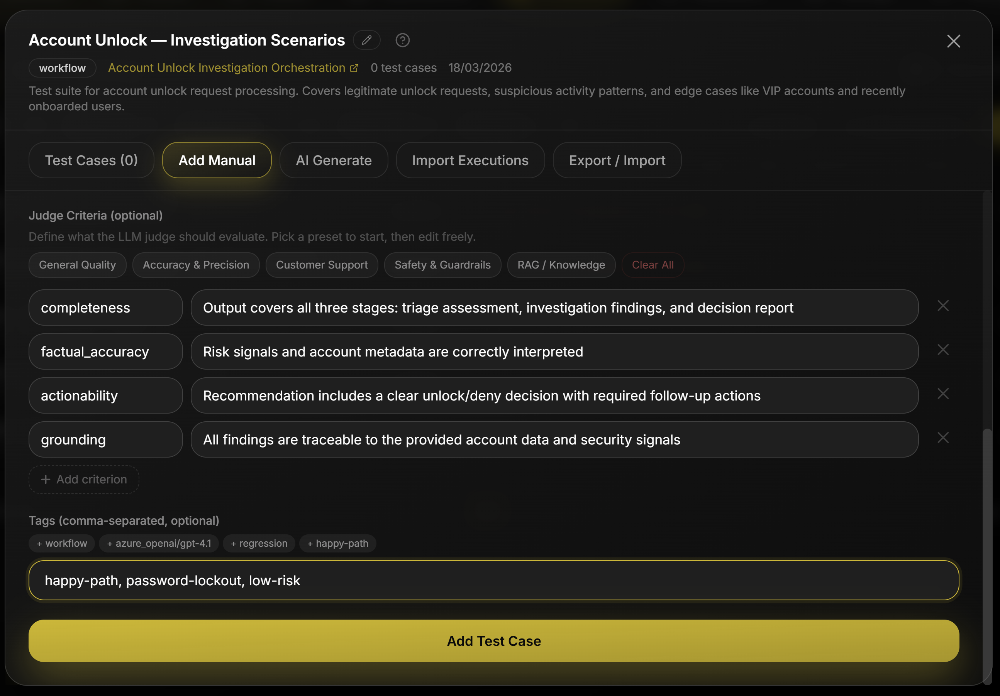

### Test Case 2: Minimal Information (Edge Case)

Add a second test case with very sparse details to test how the workflow handles incomplete information:

**Input:**

```json
{"message": "Please unlock account ACC-50821."}
```

**Expected Output:**

```json
{"summary": "The workflow should still produce a structured output, flagging missing context (no lock reason, no requester identity) and recommending additional verification steps before proceeding."}
```

**Judge Criteria:**

- `graceful_handling` → "Workflow handles sparse input without errors or hallucination"
- `completeness` → "All three pipeline stages produce output, even if caveated with uncertainty"

**Tags:** `edge-case, sparse-input`

### Test Case 3: Suspicious Activity Pattern (Boundary Test)

Test with an unlock request that has strong fraud indicators to verify the workflow correctly escalates:

**Input:**

```json
{"message": "Investigate unlock request for ACC-83402. Lock reason: suspected credential stuffing. 47 failed attempts from 12 different IP addresses across 6 countries in the past hour. Account holder has an active fraud alert on file."}
```

**Expected Output:**

```json
{
  "summary": "Triage should flag this as high-risk. Investigation should identify the multi-country IP pattern as a credential stuffing attack and note the existing fraud alert. Decision should deny the unlock and escalate to the fraud team."
}
```

**Tags:** `boundary, high-risk, fraud-indicators`

**Judge Criteria:**

- `risk_assessment` → "Risk score reflects the severity of the fraud signals"
- `actionability` → "Recommendation includes escalation to the appropriate team and specific protective actions"

### Using AI Generation for Additional Cases

To quickly build more coverage, switch to the **AI Generate** tab:

**Seed Prompt:**

```text
Generate test cases for an account unlock investigation workflow.
Include varied scenarios: password lockouts, MFA failures, admin-initiated locks,
suspicious login patterns, VIP/high-privilege accounts, recently onboarded users,
and accounts with prior fraud history.
Each test case should specify what the Triage assessment, Investigation findings,
and Decision report should contain.
```

- **Count:** 10
- **Include edge cases:** checked
- **Include adversarial inputs:** checked

Click **Generate** and wait for the cases to stream in.

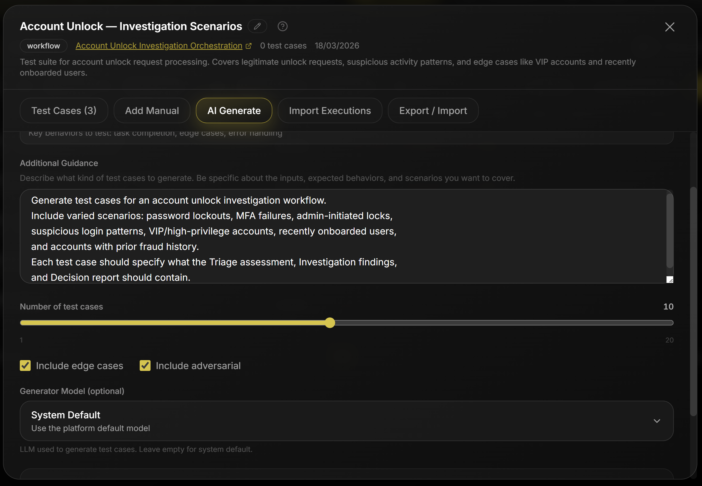

You should now have a dataset of 13+ test cases covering happy paths, edge cases, and boundary conditions.

---

## 3. Run the Evaluation

Switch to the **Runs** tab and click **+ New Run**.

- **Run Name:** `Account Unlock — Baseline`
- **Dataset:** Account Unlock — Investigation Scenarios
- **Target Type:** Workflow
- **Workflow:** Account Unlock Investigation
- **Environment:** Development
- **Judge Model:** *(select your preferred model — a strong model like GPT-4o or Claude Sonnet produces more reliable scoring)*
- **Pillar Weights:**
  - Quality: `0.50` — output correctness is the primary concern for security investigations
  - Reliability: `0.25` — the workflow must complete without errors (critical for security operations)
  - Latency: `0.15` — faster turnaround matters for account unlock requests
  - Cost: `0.10` — token efficiency is less critical than accuracy here
- **Concurrency Limit:** 5 *(Account Unlock Investigation requests are relatively lightweight)*

Click **Start Run**.

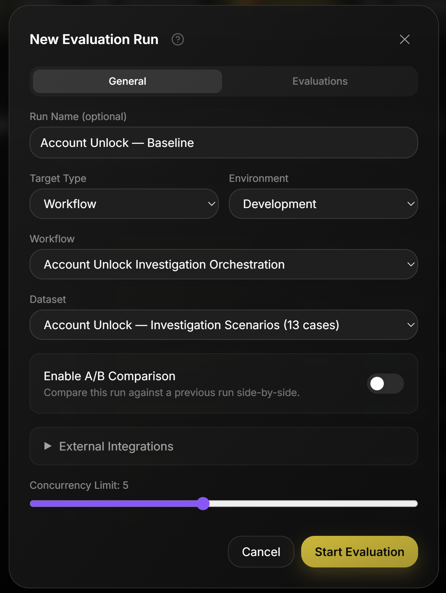

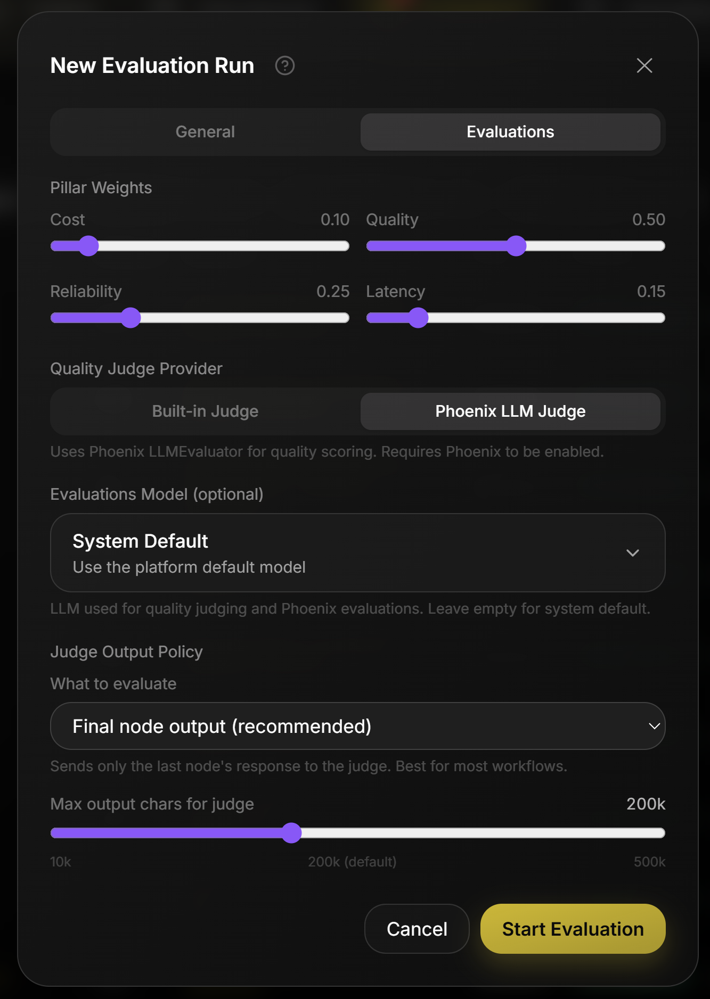

The run starts in the background. Each test case triggers a full workflow execution — the Triage agent assesses the request,
the Investigation agent analyses security signals, and Decision & Report produces the recommendation.
The AI judge then scores the output against the expected output and judge criteria.

For a dataset of 13 test cases with concurrency 5, expect the run to take a few minutes. The status updates live in the runs list.

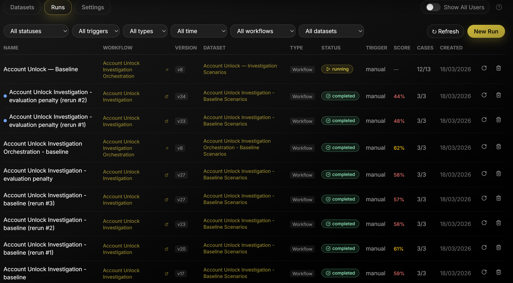

---

## 4. Analyse the Results

Once the run shows **Completed** (or **Completed with failures** if any cases errored), click it to open the detail view.

### Reading the Score Cards

The header displays five scores. For a well-tuned Account Unlock Investigation workflow, you might see something like:

| Pillar | Score | Interpretation |
|--------|-------|----------------|
| **Composite** | 78% | Weighted overall score — amber, room for improvement |
| **Quality** | 82% | The judge rates most outputs as accurate and complete — green |
| **Reliability** | 95% | Nearly all cases completed successfully — green |
| **Latency** | 70% | Most requests processed quickly; a few complex cases took longer — amber |
| **Cost** | 68% | Token usage is moderate but could be optimised — amber |

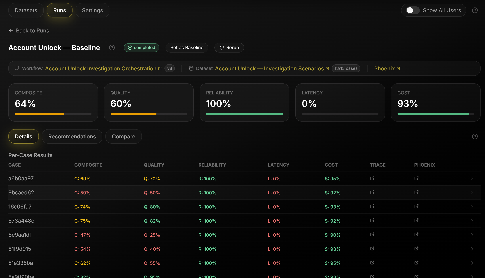

### Drilling into Per-Case Results

Switch to the **Details** sub-tab. The table shows each test case with its individual scores. Look for:

- **Red quality scores** — cases where the output missed key information or hallucinated
- **Failed reliability** — cases that errored out (check the trace for the root cause)
- **High-cost outliers** — cases that consumed disproportionate tokens

Click a row to expand the detail panel. The **quality_raw** section shows the judge's reasoning and per-criteria scores — for example:

> *"The Triage agent correctly identifies the credential stuffing pattern and flags it as high-risk.
> However, the Investigation agent fails to mention the existing fraud alert on file,
> reducing the factual_accuracy score. The Decision report recommends denial
> but does not specify which fraud team to escalate to."*

This kind of feedback pinpoints exactly what to fix.

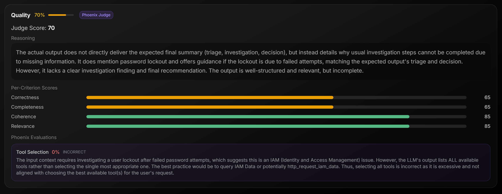

Click the **Trace** link to open the full execution in the workflow viewer, where you can see each agent's input, output, and tool calls.

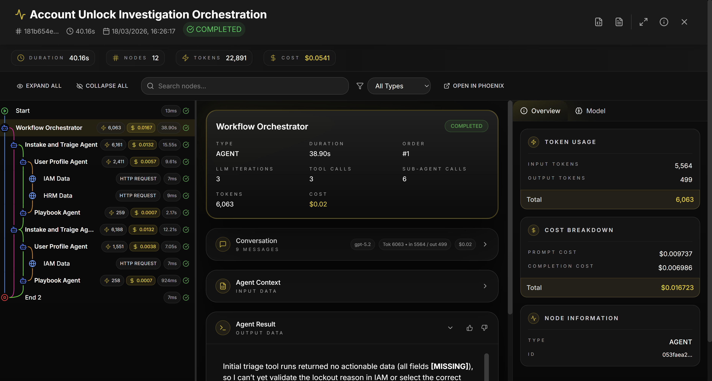

If Phoenix is enabled, you can also click **Phoenix** to open the trace in the Phoenix UI for deeper analysis.

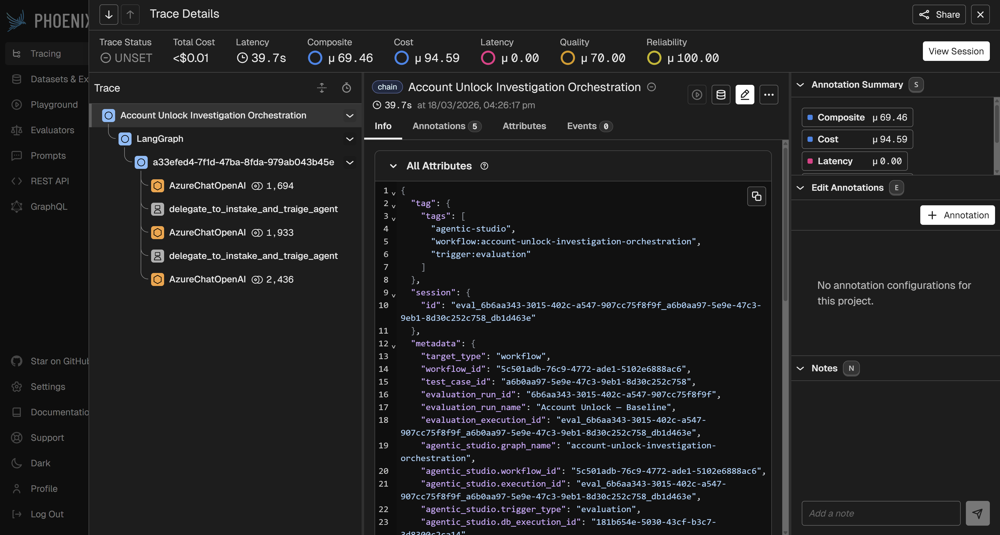

---

## 5. Set the Baseline

This is your first run, so set it as the reference point. Click **Set as Baseline** in the run header. Future runs will be compared against these scores, and regressions will be flagged automatically.

<!-- SCREENSHOT: Run detail header with "Set as Baseline" button -->

---

## 6. Review Recommendations

Open the **Recommendations** sub-tab. Based on the run results, the system might suggest:

### Example Recommendation 1: Prompt Edit (Low Risk)

> **Title:** Improve Investigation agent's fraud signal coverage
>
> **Rationale:** 3 out of 13 test cases scored below 70% on factual_accuracy because the Investigation agent missed existing fraud alerts and prior incident history. Adding explicit instructions to check all account flags would improve grounding.
>
> **Type:** `prompt_edit` | **Risk:** `low`
>
> **Expected Impact:** +8% quality

Click **Review & Apply** to see the diff. The modal shows the current system prompt alongside the proposed version,
with changes highlighted. Review the additions — for example, a new instruction like
*"Always check for existing fraud alerts, prior incident history, and account-level flags before concluding the investigation"*
— edit if needed, and click **Apply Changes**.


### Example Recommendation 2: Model Swap (Low Risk)

> **Title:** Switch Triage agent to a faster model
>
> **Rationale:** The Triage agent's initial assessment task is straightforward but accounts for 35% of total latency. A faster model would reduce latency without significant quality loss.
>
> **Type:** `model_swap` | **Risk:** `low`
>
> **Expected Impact:** –25% latency, –2% quality

Click **Apply** to accept, or **Dismiss** if you prefer the current model.

---

## 7. Re-evaluate After Changes

After applying recommendations, run the evaluation again to measure the impact:

1. Click **Rerun** in the run detail header (or create a new run from the Runs tab)
2. The new run uses the same dataset and configuration
3. Once complete, go to the **Compare** sub-tab
4. Select the baseline run and click **Compare**

The comparison table shows the delta for each pillar:

| Pillar | Baseline | After Changes | Delta |
|--------|----------|---------------|-------|
| Composite | 78% | 85% | +7% |
| Quality | 82% | 89% | +7% |
| Reliability | 95% | 95% | 0% |
| Latency | 70% | 81% | +11% |
| Cost | 68% | 70% | +2% |

The prompt edit improved quality (fewer missed fraud signals), and the model swap improved latency — confirming both recommendations delivered their expected impact.


---

## 8. Set Up Auto-Evaluation

Now that you have a solid dataset and baseline, enable auto-evaluation so future changes are tested automatically.

Go to **Settings → Auto-Evaluation**:

1. Select the **Account Unlock Investigation** workflow from the dropdown
2. Enable **Trigger on modify** — the evaluation runs whenever someone saves the workflow
3. Select **Account Unlock — Investigation Scenarios** as the dataset
4. Switch to the **Evaluations** sub-tab and keep the pillar weights from your manual run
5. Set the **Debounce Window** to 1 minute to prevent rapid retriggers during active editing

From now on, any change to the Account Unlock Investigation workflow automatically triggers an evaluation run. If the scores drop below the baseline by 10% or more, a regression warning appears on the run.


---

## Phoenix Integration

When Phoenix observability is enabled, evaluation runs gain additional capabilities:

### Supplementary Evaluators

Phoenix runs supplementary evaluators alongside the built-in 4-pillar scoring:

- **Faithfulness** — detects hallucinations by checking whether the output is grounded in the provided context
- **Tool Selection** — evaluates whether the correct tools were selected and called appropriately
- **LLM Judge** — an independent quality judge from Phoenix (optional, disabled by default)

Supplementary scores appear in the result detail panel alongside the standard pillar scores. If **quality penalty** is enabled (in Settings), low faithfulness scores reduce the quality pillar score.

### Judge Provider Selection

When creating a new run, you can choose between two judge providers:

- **Built-in** (default) — scores against your custom criteria and expected outputs
- **Phoenix** — uses Phoenix's LLM judge for an independent quality assessment

The default provider can be configured in **Evaluations → Settings → General Defaults → Evaluations** tab.

### Trace Deep-Links

Each evaluation result includes a "View in Phoenix" link that opens the exact trace in the Phoenix UI. The evaluation run summary also links to the Phoenix project showing all traces for that run.

### Dataset and Experiment Sync

Evaluation datasets and run results are mirrored into Phoenix as experiments, enabling side-by-side comparison of multiple runs in the Phoenix UI.

---

## Access Control

Evaluations are controlled by the `nav.evaluations` feature access setting. By default, all users can access evaluations. Administrators can restrict access to admins only via **Settings → Admin → Access**.

If you see the Evaluations link in the navigation but get a permission error, contact your administrator to check the feature access settings.

---

## Tips

- **Start with a small dataset** (5–10 cases) and expand as you learn what matters. Larger datasets take longer to run and cost more tokens.
- **Use judge criteria** specific to your domain. For investigation workflows, criteria like `factual_accuracy`, `risk_assessment`, `completeness`, and `actionability` are more useful than generic "quality".
- **Compare against the same dataset** for meaningful comparisons. Changing both the workflow and the test cases at the same time makes it hard to attribute improvements.
- **Review judge reasoning** rather than just scores. The judge's rationale often reveals specific failure modes that a number alone would miss.
- **Set baselines early.** Even an imperfect first run gives you a reference point for measuring progress.
- **Use file attachments** for workflows that process documents. The evaluation system handles files the same way the workflow does in production — they're uploaded and injected into the execution.

---

## Related

- [Creating a Workflow](./01-creating-a-workflow.md) — Build and run workflows
- [Execution History](./06-executions.md) — View execution traces and node-level details
- [Publishing a Workflow](./03-publishing-a-workflow.md) — Expose workflows as HTTP endpoints
- [Phoenix Trace Analysis](./10-phoenix-trace-analysis.md) — Explore LLM traces and evaluation annotations in Phoenix
- [Settings](./07-settings.md) — Configure feature access, default judge provider, and external services
